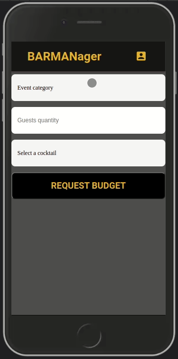

# BARMANager

BARMANager is a proposal generator based on the client's needs, with the information passed it calculates the expenses and sends it to the company's email.

<table>
<tr>
<th>Demo usage</th>
<th>The output email</th>
</tr>
<tr>
<td></td>
<td>
<h4><strong>New Birthday budget request for 100 guests</strong></h4><hr>
 <h6>Customer infos:</h6>
  <p>
    Name: John<br>
    Email: john@mail.com<br>
    Phone: 12345678911<br>
</p><hr>
 <h6><strong>Total suggested price: $ 2393,72</strong></h6><hr>
  <div style="margin:16px;">
    Costs:<br>
      1 Bartender leader - $ 350,00<br>2 Bartender - $ 280,00<br>1 Installation - $ 60,00<br>
   1 Transport - $ 50,00<br>3 Laundry - $ 30,00<br>3 Equipment depreciation - $ 30,00<br>1 Furniture - $ 160,00<br>
      total: $ 960,00;<br>
    <br>Cocktails:<br>
      400 Caipirinha - $ 934,76<br>
      total: $ 934,76;<br>
    <br>Disposables:<br>
      400 Straw - $ 80,00<br>400 Napkin - $ 20,00<br>
      total: $ 100,00;<br>
    </div>
</div></td>
</tr>
</table>

[Try it out now](http://barmanager-front.vercel.app/)

[You can check the back-end repo](https://github.com/leonardo-otero390/barmanager-back)

## About

This project seems simple, but it's helpful if you work with events. Imagine it, John owns a bartender company that provides cocktails for parties such as birthdays or weddings, so his principal responsibilities are:

- Train bartenders and other staff.
- Buy ingredients for that event
- Talk to customers, make budgets, and sign contracts
- Allocate the exact number of staff for each event
- Take care of taxes or any issue a general company has

Luckily his company is famous in town, so he receives more than 50 budget requests per week. John is an old-fashioned guy and keeps all his recipes and expenses in a notebook because he thinks it's the safer way. The problem is he doesn't have time to calculate budgets and answer his customers in time, so he lost a lot of money.
What problems does BARMANager solve?

- John can save his recipes and customers' data.
- Can calculate budgets and answer customers much way faster.
- Sign more contracts
- Pay attention to the other responsibilities

Below are the implemented features:

- Auth
- Display to customer selection events categories and available cocktails
- Customer send their proposes

## Technologies

The following tools and frameworks were used in the construction of the project:

<a title="React" href="https://pt-br.reactjs.org/" target="_blank" rel="noreferrer"> 
     
</a>
<a title="HTML" href="https://www.w3.org/html/" target="_blank" rel="noreferrer"> 
     
</a>
<a title="CSS" href="https://www.w3schools.com/css/" target="_blank" rel="noreferrer"> 
     
</a>
<a title="TypeScript" href="https://www.typescriptlang.org/" target="_blank" rel="noreferrer"> 
      
</a>

## Requirements

### [npm](https://www.npmjs.com/)

<details>
    <summary>install npm</summary>

```bash
wget -qO- <https://raw.githubusercontent.com/nvm-sh/nvm/v0.38.0/install.sh> | bash

## Or this command
wget -qO- https://raw.githubusercontent.com/nvm-sh/nvm/v0.38.0/install.sh | bash

# Close and open terminal
nvm install --lts
nvm use --lts
# Verify node version
node --version # Must show v14.16.1
# Verify npm version
npm -v
```

</details>

## How to run

1. Clone this repository
2. Clone the [back-end repository](https://github.com/leonardo-otero390/barmanager-back) and follow instructions
3. Install dependencies

```bash
npm i
```

4. Run the front-end with production database

```bash
npm start
```

5. If you want to run with backend development mode

```bash
npm run dev
```

6. You can optionally build the project running

```bash
npm run build
```
